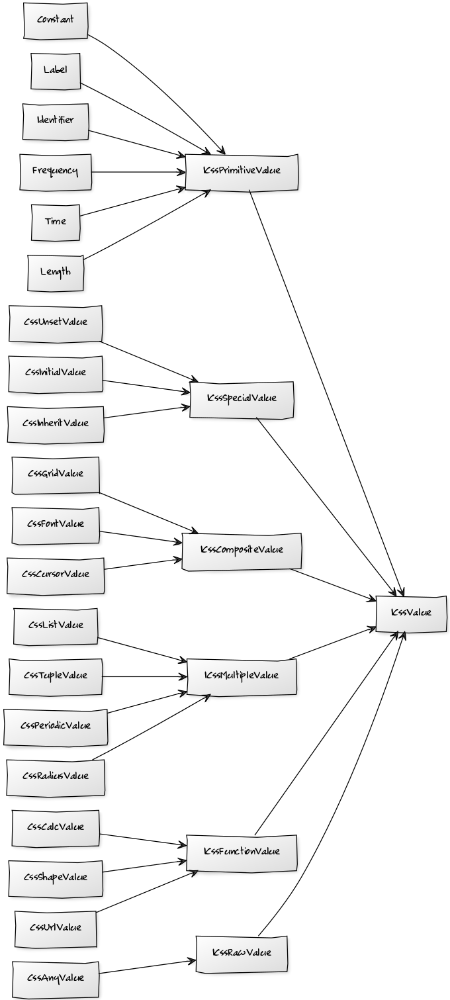

# API Documentation

## CSSOM - Basics

The CSS Object Model (CSSOM) consists of multiple parts. On the one hand we have standard Document Object Model (DOM) exposed interfaces, such as the stylesheets, styles, or rules, on the other hand we have special constructs only available in AngleSharp to dig deeper into the provided CSS.

The AngleSharp CSS parser can construct objects of the following high-level types:

- `ICssStyleSheet`, representing a full CSS stylesheet
- `ICssRule`, representing a rule within a CSS stylesheet
- `ICssKeyframeRule`, representing a special keyframe rule (only exposed since the DOM directly connects to it)
- `ICssStyleDeclaration`, representing the keeper of CSS declarations

A CSS declaration is a CSS property, e.g., `color` together with its value (e.g., `red`) and priority ("important" or not). Declarations are rather complicated as they appear not only in primitive fashion as seen earlier (`color`), but also in form of *shorthands* such as `background`. In the latter case the shorthand is expanded into all contained *longhands* (e.g., `background-color`, `background-image`, ...) and stored in this primitive way. Retrieving the shorthand later on is done via a recombination of the *currently* available longhands.

The topic with longhands and shorthands is especially complicated in face of *defered computation*. This is the case once a calculated value is hit, which is necessary for the rule to be validated, but cannot be calculated during sheet evaluation time (i.e., the calculation has to take place with the cascade coming from the DOM). The simplest example is `var`. CSS variables are evaluated only with the cascade in mind. In this case no simple expansion of the shorthand into longhands is possible. Instead, AngleSharp will "fake" a potential expansion with a reference value, which can then be resolved later.

There are multiple types of rules. Depending on the type of rule other rules may be the children of the rule. While a style rule is the most elementary one (essentially just containing an `ICssStyleDeclaration` instance) one example of a container rule is the media rule. This type of rule hosts other rules.

## CSSOM - Values

The most interesting part of a CSS declaration is the value part. This is also the complicated part as values are always given in string form. The parsing is completely dependent on the type of declaration. Some fixed / known types and parsing rules exist, however, the exact setup of a declaration is completely arbitrary.

AngleSharp uses converters to parse a given source to an `ICssValue` instance. The converter follows the `IValueConverter` interface.

The `ICssValue` interface is split in various interfaces with respect to their usage.



A converter may also implement the `IValueAggregator` interface, which indicates that the declaration behind it is actually a shorthand that can additionally merge values into a shorthand representation or split the shorthand representation into the atoms described by the shorthand.

For convenience some (extension) methods have been introduced to make working with the CSSOM (specifically values) simpler. The shown extension methods are placed in the `AngleSharp.Css.Dom` namespace.

```cs
// sheet is a stylesheet, e.g., obtained from a document, with content:
//   p > a { border: 1px solid red }
var rule = sheet.GetStyleRuleWith("p>a");
var color = rule.GetValueOf("border-right-color").AsRgba();
// the color is an Int32, e.g., 0xFF_FF - same as rgba(255, 0, 0, 1)
```

The idea behind `GetStyleRuleWith` is to get the first top-level style rule that matches the given selector exactly. The text of the selector does not have to be equal to the text of the selector in the stylesheet, but it needs to be equal *semantically*, i.e., in the provided example the spaces do not matter as the semantics are not influenced by them.

The `GetValueOf` obtains the `ICssValue` instance behind the property with the given name. The `AsRgba` works (like all the other `As*` extension methods) against the `ICssValue` to get an elementary value out of it. This works in simple cases, but will fail, e.g., when there are multiple values available or when the primitive value is hidden in a composite one.
